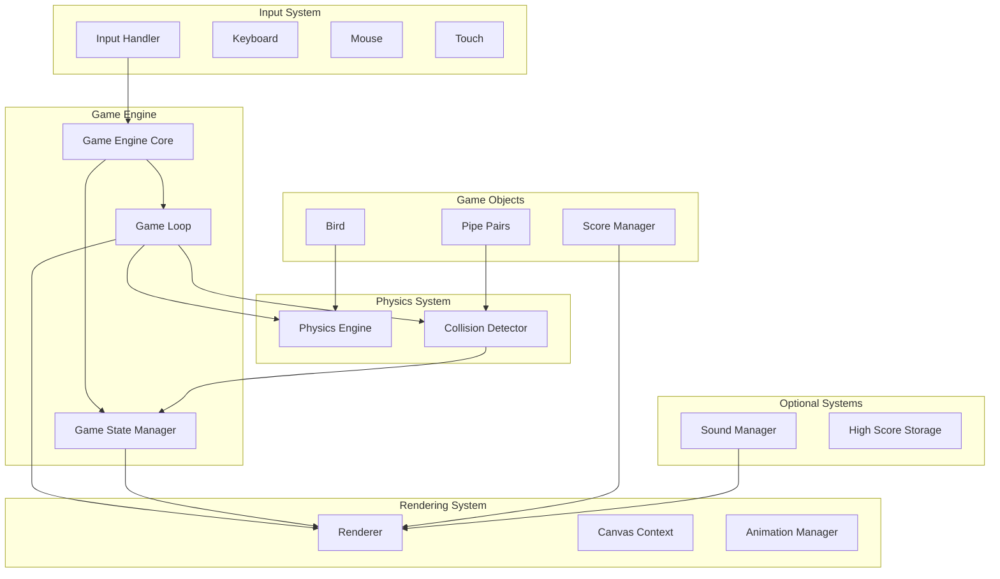

# Design Document: Flappy Bird Game

## Overview

The Flappy Bird game is a 2D side-scrolling game implemented using HTML5 Canvas, CSS, and vanilla JavaScript. The player controls a bird character that must navigate through randomly generated pipe obstacles by tapping/clicking to make the bird flap and gain altitude. The game features gravity physics, collision detection, scoring, and game state management.

### Core Gameplay Loop
1. Player taps/click to make the bird flap upward
2. Gravity pulls the bird downward continuously
3. Pipes move from right to left at constant speed
4. Player scores points by passing through pipe gaps
5. Game ends when bird collides with pipes, ground, or ceiling
6. Player can restart from game over screen

### Key Design Goals
- **Performance**: Maintain 30+ FPS on both desktop and mobile
- **Responsiveness**: Support keyboard, mouse, and touch inputs
- **Maintainability**: Clean separation of concerns with modular architecture
- **Extensibility**: Easy to add new features (power-ups, different birds, etc.)
- **Accessibility**: Clear visual feedback and intuitive controls

## Architecture

### High-Level System Architecture



### Component Relationships

1. **Game Engine** orchestrates all systems
2. **Game Loop** drives frame updates using `requestAnimationFrame`
3. **Input Handler** captures user input and passes to Game Engine
4. **Physics Engine** updates bird position based on gravity and velocity
5. **Collision Detector** checks for collisions between bird and obstacles
6. **Renderer** draws all game objects to canvas
7. **Game State Manager** handles state transitions (START, PLAYING, GAME_OVER)
8. **Score Manager** tracks and displays score

### File Structure
```
flappy-bird-game/
├── index.html          # Main HTML file
├── css/
│   └── style.css      # CSS styles
├── js/
│   ├── game.js        # Game Engine and main entry point
│   ├── bird.js        # Bird class and physics
│   ├── pipe.js        # Pipe generation and management
│   ├── collision.js   # Collision detection
│   ├── renderer.js    # Canvas rendering
│   ├── score.js       # Score management
│   ├── input.js       # Input handling
│   ├── state.js       # Game state management
│   └── sound.js       # Sound effects (optional)
└── assets/
    ├── images/        # Game sprites
    └── sounds/        # Sound files
```

## Components and Interfaces

### 1. Game Engine (`game.js`)

**Responsibilities:**
- Main game loop using `requestAnimationFrame`
- Orchestrates all subsystems
- Manages frame timing and delta time calculation
- Handles game initialization and cleanup

**Interface:**
```javascript
class GameEngine {
    constructor(canvas, config) {
        this.canvas = canvas;
        this.ctx = canvas.getContext('2d');
        this.config = config;
        this.stateManager = new GameStateManager();
        this.renderer = new Renderer(canvas, ctx);
        this.physicsEngine = new PhysicsEngine(config.physics);
        this.collisionDetector = new CollisionDetector();
        this.scoreManager = new ScoreManager();
        this.inputHandler = new InputHandler(canvas);
        this.bird = new Bird(config.bird);
        this.pipeManager = new PipeManager(config.pipes);
        this.soundManager = config.soundEnabled ? new SoundManager() : null;
    }
    
    start() { /* Initialize and start game loop */ }
    stop() { /* Stop game loop */ }
    update(deltaTime) { /* Update all game objects */ }
    render() { /* Render current frame */ }
    reset() { /* Reset game to initial state */ }
}
```

### 2. Bird Component (`bird.js`)

**Responsibilities:**
- Bird physics (gravity, velocity, position)
- Jump/flap behavior
- Visual representation and animation
- State management (alive/dead)

**Interface:**
```javascript
class Bird {
    constructor(config) {
        this.x = config.startX;
        this.y = config.startY;
        this.width = config.width;
        this.height = config.height;
        this.velocityY = 0;
        this.gravity = config.gravity;
        this.jumpForce = config.jumpForce;
        this.isAlive = true;
        this.animationFrame = 0;
    }
    
    jump() { /* Apply upward velocity */ }
    update(deltaTime) { /* Update position based on physics */ }
    getBounds() { /* Return bounding box for collision */ }
    draw(ctx) { /* Draw bird to canvas */ }
}
```

### 3. Pipe Manager (`pipe.js`)

**Responsibilities:**
- Generate pipe pairs at regular intervals
- Manage pipe movement and removal
- Randomize pipe heights within constraints
- Track which pipes have been scored

**Interface:**
```javascript
class PipeManager {
    constructor(config) {
        this.pipes = [];
        this.gapHeight = config.gapHeight;
        this.pipeWidth = config.pipeWidth;
        this.pipeSpeed = config.pipeSpeed;
        this.spawnInterval = config.spawnInterval;
        this.lastSpawnTime = 0;
        this.maxPipes = config.maxPipes;
    }
    
    update(deltaTime, canvasWidth) { /* Update pipe positions and spawn new ones */ }
    spawnPipe(canvasHeight) { /* Create new pipe pair */ }
    removeOffscreenPipes() { /* Remove pipes that have moved off screen */ }
    getPipes() { /* Return all active pipes */ }
    draw(ctx) { /* Draw all pipes */ }
}
```

### 4. Collision Detector (`collision.js`)

**Responsibilities:**
- Detect collisions between bird and pipes
- Detect collisions with ground and ceiling
- Use efficient bounding box detection
- Provide collision information to game engine

**Interface:**
```javascript
class CollisionDetector {
    checkBirdPipeCollision(bird, pipes) { /* Check bird against all pipes */ }
    checkBirdGroundCollision(bird, groundY) { /* Check if bird hit ground */ }
    checkBirdCeilingCollision(bird, ceilingY) { /* Check if bird hit ceiling */ }
    checkPipeScored(bird, pipe) { /* Check if bird passed through pipe gap */ }
    
    // Helper methods
    rectIntersect(rect1, rect2) { /* Bounding box intersection test */ }
}
```

### 5. Renderer (`renderer.js`)

**Responsibilities:**
- Draw all game objects to canvas
- Handle different game states (start screen, gameplay, game over)
- Manage canvas scaling and responsive design
- Implement simple animations

**Interface:**
```javascript
class Renderer {
    constructor(canvas, ctx) {
        this.canvas = canvas;
        this.ctx = ctx;
        this.assets = {}; // Loaded images/sprites
    }
    
    drawBackground() { /* Draw sky/background */ }
    drawGround() { /* Draw ground element */ }
    drawBird(bird) { /* Draw bird with animation */ }
    drawPipes(pipes) { /* Draw all pipes */ }
    drawScore(score, highScore) { /* Draw score display */ }
    drawStartScreen() { /* Draw start screen UI */ }
    drawGameOverScreen(score, highScore) { /* Draw game over UI */ }
    clear() { /* Clear canvas */ }
    
    // Responsive design
    resize(width, height) { /* Handle canvas resizing */ }
}
```

### 6. Score Manager (`score.js`)

**Responsibilities:**
- Track current score
- Track high score (persistent across sessions)
- Prevent duplicate scoring for same pipe
- Display score on screen

**Interface:**
```javascript
class ScoreManager {
    constructor() {
        this.currentScore = 0;
        this.highScore = this.loadHighScore();
        this.scoredPipes = new Set(); // Track which pipes have been scored
    }
    
    increment() { /* Increment current score */ }
    reset() { /* Reset current score for new game */ }
    saveHighScore() { /* Save high score to localStorage */ }
    loadHighScore() { /* Load high score from localStorage */ }
    markPipeScored(pipeId) { /* Mark pipe as scored */ }
    isPipeScored(pipeId) { /* Check if pipe already scored */ }
}
```

### 7. Input Handler (`input.js`)

**Responsibilities:**
- Handle keyboard input (spacebar)
- Handle mouse clicks
- Handle touch events (mobile)
- Normalize input across different devices

**Interface:**
```javascript
class InputHandler {
    constructor(canvas) {
        this.canvas = canvas;
        this.jumpCallbacks = [];
        this.restartCallbacks = [];
        this.setupEventListeners();
    }
    
    setupEventListeners() {
        // Keyboard events
        document.addEventListener('keydown', this.handleKeyDown.bind(this));
        // Mouse events
        this.canvas.addEventListener('click', this.handleClick.bind(this));
        // Touch events
        this.canvas.addEventListener('touchstart', this.handleTouch.bind(this));
    }
    
    handleKeyDown(event) { /* Handle spacebar press */ }
    handleClick(event) { /* Handle mouse click */ }
    handleTouch(event) { /* Handle touch event */ }
    
    onJump(callback) { /* Register jump callback */ }
    onRestart(callback) { /* Register restart callback */ }
}
```

### 8. Game State Manager (`state.js`)

**Responsibilities:**
- Manage game states (START, PLAYING, GAME_OVER)
- Handle state transitions
- Control which systems are active in each state
- Manage UI visibility based on state

**Interface:**
```javascript
class GameStateManager {
    constructor() {
        this.currentState = 'START'; // START, PLAYING, GAME_OVER
        this.stateCallbacks = {};
    }
    
    setState(newState) { /* Change game state */ }
    getState() { /* Return current state */ }
    isPlaying() { /* Check if in PLAYING state */ }
    isGameOver() { /* Check if in GAME_OVER state */ }
    
    onStateChange(state, callback) { /* Register state change callback */ }
}
```

### 9. Sound Manager (`sound.js`) - Optional

**Responsibilities:**
- Load and play sound effects
- Manage audio volume and mute state
- Handle audio loading errors gracefully

**Interface:**
```javascript
class SoundManager {
    constructor() {
        this.sounds = {};
        this.isMuted = false;
        this.loadSounds();
    }
    
    loadSounds() { /* Load audio files */ }
    playJump() { /* Play jump sound */ }
    playScore() { /* Play score sound */ }
    playCollision() { /* Play collision sound */ }
    toggleMute() { /* Toggle mute state */ }
    setVolume(volume) { /* Set volume level */ }
}
```

## Data Models

### 1. Game Configuration
```javascript
const GameConfig = {
    // Canvas settings
    canvas: {
        width: 800,
        height: 600,
        backgroundColor: '#70c5ce'
    },
    
    // Bird settings
    bird: {
        startX: 100,
        startY: 300,
        width: 34,
        height: 24,
        gravity: 0.5,
        jumpForce: -10,
        maxVelocity: 15,
        animationFrames: 3,
        animationSpeed: 0.15
    },
    
    // Pipe settings
    pipes: {
        width: 52,
        gapHeight: 150,
        minPipeHeight: 50,
        maxPipeHeight: 350,
        speed: 2,
        spawnInterval: 1500, // milliseconds
        maxPipes: 5,
        color: '#73bf2e'
    },
    
    // Game settings
    game: {
        groundHeight: 112,
        ceilingHeight: 0,
        fps: 60,
        scoreIncrement: 1
    },
    
    // Sound settings
    sound: {
        enabled: true,
        volume: 0.5,
        jumpSound: 'assets/sounds/jump.mp3',
        scoreSound: 'assets/sounds/score.mp3',
        collisionSound: 'assets/sounds/collision.mp3'
    }
};
```

### 2. Bird State
```javascript
class BirdState {
    constructor() {
        this.position = { x: 0, y: 0 };
        this.velocity = { x: 0, y: 0 };
        this.isAlive = true;
        this.animation = {
            currentFrame: 0,
            frameTime: 0,
            isFlapping: false
        };
        this.bounds = {
            x: 0, y: 0,
            width: 0, height: 0
        };
    }
}
```

### 3. Pipe State
```javascript
class PipeState {
    constructor(id, x, topHeight, bottomHeight, gapY) {
        this.id = id;
        this.x = x;
        this.top = {
            x: x,
            y: 0,
            width: 0,
            height: topHeight
        };
        this.bottom = {
            x: x,
            y: gapY,
            width: 0,
            height: bottomHeight
        };
        this.gap = {
            x: x,
            y: topHeight,
            width: 0,
            height: 0
        };
        this.isScored = false;
        this.isActive = true;
    }
}
```

### 4. Game State
```javascript
class GameState {
    constructor() {
        this.currentState = 'START'; // START, PLAYING, GAME_OVER
        this.score = 0;
        this.highScore = 0;
        this.frameCount = 0;
        this.deltaTime = 0;
        this.lastFrameTime = 0;
        this.isPaused = false;
        this.activePipes = [];
        this.gameTime = 0;
    }
}
```

### 5. Input State
```javascript
class InputState {
    constructor() {
        this.keys = {
            space: false,
            enter: false
        };
        this.mouse = {
            x: 0,
            y: 0,
            isDown: false
        };
        this.touch = {
            x: 0,
            y: 0,
            isActive: false
        };
        this.lastInputTime = 0;
        this.inputCooldown = 100; // milliseconds
    }
}
```

### 6. Render State
```javascript
class RenderState {
    constructor() {
        this.canvasSize = { width: 0, height: 0 };
        this.scaleFactor = 1;
        this.assetsLoaded = false;
        this.backgroundOffset = 0;
        this.groundOffset = 0;
        this.parallaxSpeed = 0.5;
        this.uiElements = {
            score: { visible: true, position: { x: 0, y: 0 } },
            startScreen: { visible: false, position: { x: 0, y: 0 } },
            gameOverScreen: { visible: false, position: { x: 0, y: 0 } }
        };
    }
}
```

## Physics and Algorithms

### 1. Bird Physics Algorithm
```
For each frame (deltaTime in seconds):
  1. Apply gravity: velocityY += gravity * deltaTime
  2. Limit velocity: velocityY = clamp(velocityY, -maxVelocity, maxVelocity)
  3. Update position: y += velocityY * deltaTime
  4. On jump: velocityY = jumpForce
  5. Apply damping (optional): velocityY *= 0.99
```

### 2. Pipe Generation Algorithm
```
When spawn timer exceeds spawnInterval:
  1. Calculate available height: canvasHeight - groundHeight
  2. Generate random gap position: 
     gapY = random(minPipeHeight, availableHeight - gapHeight - minPipeHeight)
  3. Calculate pipe heights:
     topHeight = gapY
     bottomHeight = availableHeight - gapY - gapHeight
  4. Create pipe pair at x = canvasWidth
  5. Add to active pipes array
  6. Reset spawn timer
```

### 3. Collision Detection Algorithm
```
For bird bounding box (birdBounds):
  1. Ground collision: birdBounds.bottom >= groundY
  2. Ceiling collision: birdBounds.top <= ceilingY
  3. Pipe collision (for each pipe):
     a. Check top pipe: rectIntersect(birdBounds, pipe.top)
     b. Check bottom pipe: rectIntersect(birdBounds, pipe.bottom)
  4. Scoring detection (for each unscored pipe):
     a. Check if birdBounds.right > pipe.gap.left
     b. Check if birdBounds.left < pipe.gap.right
     c. Check if birdBounds.top > pipe.gap.top
     d. Check if birdBounds.bottom < pipe.gap.bottom
```

### 4. Game Loop Algorithm
```
function gameLoop(currentTime):
  1. Calculate deltaTime = currentTime - lastFrameTime
  2. lastFrameTime = currentTime
  
  3. Process input events
  
  4. If state == PLAYING:
     a. Update physics (bird, pipes)
     b. Check collisions
     c. Update score
     d. Update game time
     
  5. Render current frame based on state
  
  6. Request next animation frame: requestAnimationFrame(gameLoop)
```

### 5. Responsive Scaling Algorithm
```
On window resize or initialization:
  1. Get container dimensions
  2. Calculate scale factor = min(containerWidth / baseWidth, containerHeight / baseHeight)
  3. Set canvas dimensions = baseDimensions * scaleFactor
  4. Update all positional values based on scale factor
  5. Adjust font sizes and UI elements proportionally
```

## User Interface Design

### 1. Screen Layouts

**Start Screen:**
```
┌─────────────────────────────────────┐
│                                     │
│           FLAPPY BIRD               │
│                                     │
│        [ Tap to Start ]             │
│                                     │
│    Use SPACEBAR or CLICK/TAP        │
│    to make the bird flap            │
│                                     │
│    High Score: 25                   │
│                                     │
└─────────────────────────────────────┘
```

**Gameplay Screen:**
```
┌─────────────────────────────────────┐
│  Sky Background                     │
│                                     │
│      Score: 12      ┌─┐            │
│                     │ │   Pipe     │
│            Bird → ○ │ │            │
│                     │ │            │
│                     └─┘            │
│                                     │
│  ────────────────────────────────  │ Ground
│                                     │
└─────────────────────────────────────┘
```

**Game Over Screen:**
```
┌─────────────────────────────────────┐
│                                     │
│           GAME OVER                 │
│                                     │
│        Score: 18                    │
│        High Score: 25               │
│                                     │
│        [ Play Again ]               │
│                                     │
└─────────────────────────────────────┘
```

### 2. Visual Design Elements

**Color Palette:**
- Sky: `#70c5ce` (light blue)
- Ground: `#ded895` (sand/tan)
- Pipes: `#73bf2e` (green)
- Bird: `#f2d22e` (yellow)
- Text: `#333333` (dark gray)
- UI Elements: `#ffffff` (white) with `#4a90e2` (blue) accents

**Typography:**
- Game Title: `'Press Start 2P', monospace` (pixel font)
- Score Display: `'Arial Black', sans-serif`
- Instructions: `'Arial', sans-serif`

**Animations:**
- Bird: 3-frame flapping animation
- Pipes: Smooth horizontal movement
- Score: Quick pop animation when incrementing
- Game Over: Fade in/out transitions

### 3. Responsive Design Rules
```
Breakpoints:
- Desktop: 800px+ (full game size)
- Tablet: 600-799px (scaled 0.8x)
- Mobile: 320-599px (scaled 0.6x, touch-optimized)

Touch Target Sizes:
- Buttons: min 44x44px
- Game area: full screen tap
- Restart button: prominent and accessible
```

## Implementation Approach

### 1. HTML5 Canvas Strategy

**Canvas Setup:**
```html
<canvas id="gameCanvas" width="800" height="600">
    Your browser does not support HTML5 Canvas.
</canvas>
```

**Rendering Optimization:**
- Use `requestAnimationFrame` for smooth animation
- Implement double buffering if needed
- Batch draw calls for similar objects
- Use image sprites instead of drawing primitives
- Implement dirty rectangle rendering for static elements

### 2. CSS Strategy

**Responsive Container:**
```css
#gameContainer {
    display: flex;
    justify-content: center;
    align-items: center;
    min-height: 100vh;
    background: #f0f0f0;
}

#gameCanvas {
    max-width: 100%;
    max-height: 100vh;
    box-shadow: 0 4px 8px rgba(0,0,0,0.1);
}
```

**Mobile Optimization:**
```css
@media (max-width: 600px) {
    #gameCanvas {
        width: 100%;
        height: auto;
    }
    
    body {
        margin: 0;
        padding: 0;
        overflow: hidden;
        touch-action: manipulation;
    }
}
```

### 3. Vanilla JavaScript Strategy

**Module Pattern:**
```javascript
// Use IIFE for module encapsulation
const GameModule = (function() {
    // Private variables and functions
    let canvas, ctx, gameEngine;
    
    // Public API
    return {
        init: function(containerId, config) {
            // Initialize game
        },
        start: function() {
            // Start game
        },
        pause: function() {
            // Pause game
        },
        restart: function() {
            // Restart game
        }
    };
})();
```

**Performance Optimizations:**
- Object pooling for pipes
- Pre-calculate values where possible
- Use integer math for positions
- Minimize DOM operations
- Debounce resize events

**Error Handling:**
```javascript
try {
    gameEngine.start();
} catch (error) {
    console.error('Game initialization failed:', error);
    showErrorScreen('Failed to start game. Please refresh.');
}
```

### 4. Asset Loading Strategy

**Preloading:**
```javascript
class AssetLoader {
    constructor() {
        this.images = {};
        this.sounds = {};
        this.loadedCount = 0;
        this.totalCount = 0;
    }
    
    loadImage(key, url) {
        this.totalCount++;
        const img = new Image();
        img.onload = () => this.onAssetLoaded();
        img.onerror = () => this.onAssetError(key, url);
        img.src = url;
        this.images[key] = img;
    }
    
    onAssetLoaded() {
        this.loadedCount++;
        if (this.loadedCount === this.totalCount) {
            this.onAllLoaded();
        }
    }
}
```

### 5. Testing Strategy

**Unit Tests:**
- Physics calculations
- Collision detection
- Score management
- State transitions

**Integration Tests:**
- Game loop integration
- Input handling
- Rendering pipeline
- Sound system

**Performance Tests:**
- Frame rate consistency
- Memory usage
- Load times
- Mobile performance

### 6. Deployment Strategy

**Build Process:**
1. Minify JavaScript
2. Optimize images
3. Bundle assets
4. Generate service worker for offline play

**Hosting:**
- Static file hosting (GitHub Pages, Netlify, Vercel)
- CDN for assets
- HTTPS required for sound playback

**Analytics:**
- Game start events
- Score distribution
- Session duration
- Device/browser statistics


## Correctness Properties

*A property is a characteristic or behavior that should hold true across all valid executions of a system—essentially, a formal statement about what the system should do. Properties serve as the bridge between human-readable specifications and machine-verifiable correctness guarantees.*

### Property 1: Physics Consistency

*For any* time delta `dt`, initial bird position `(x, y)`, initial velocity `vy`, gravity constant `g`, and jump force `j`, the physics engine SHALL update the bird's position and velocity according to the equations:
- `vy' = vy + g * dt` (gravity application)
- `y' = y + vy' * dt` (position update)
- If jump triggered: `vy' = j` (jump force application)

**Validates: Requirements 2.1, 2.5, 3.4**

### Property 2: Input Response Consistency

*For any* valid input event (spacebar press, canvas click, or touch) received during PLAYING state, the bird SHALL receive the configured jump force upward velocity, regardless of the input method used.

**Validates: Requirements 2.2, 2.3, 2.4**

### Property 3: Pipe Generation Validity

*For any* pipe pair generated with canvas height `H`, ground height `G`, gap height `gap`, and minimum pipe height `minH`, the generated pipe SHALL satisfy:
- `topHeight ≥ minH`
- `bottomHeight ≥ minH`
- `topHeight + gap + bottomHeight = H - G`
- Pipe positions move left at constant speed: `x' = x - speed * dt`
- When `x + width < 0`, pipe is removed
- Active pipe count never exceeds maximum configured limit

**Validates: Requirements 3.1, 3.2, 3.3, 3.4, 3.5, 3.6**

### Property 4: Collision Detection Accuracy

*For any* bird bounding box `B` and obstacle bounding box `O` (pipe, ground, or ceiling), the collision detector SHALL return `true` if and only if the rectangles intersect geometrically, using efficient bounding box intersection logic.

**Validates: Requirements 4.1, 4.2, 4.3, 4.5**

### Property 5: State Transition Integrity

*For any* game event (collision, restart click, start input), the state manager SHALL transition between START, PLAYING, and GAME_OVER states according to the valid transition rules:
- START → PLAYING on first input
- PLAYING → GAME_OVER on collision
- GAME_OVER → START on restart
- Game loop runs only in PLAYING state

**Validates: Requirements 4.4, 6.1, 6.3, 6.5, 6.6**

### Property 6: Scoring Correctness

*For any* pipe pair `P` and bird trajectory, the score manager SHALL:
- Increment score when bird passes completely through pipe gap
- Never increment score for the same pipe more than once
- Update high score when current score exceeds it
- Track scores accurately across game sessions

**Validates: Requirements 5.1, 5.3, 5.5**

### Property 7: Responsive Rendering

*For any* screen dimensions `(width, height)` within supported range, the renderer SHALL:
- Scale game elements proportionally without distortion
- Maintain visual quality and readability
- Position UI elements appropriately for the screen size
- Handle window resize events without visual artifacts

**Validates: Requirements 1.4, 7.6, 9.2, 9.4**

### Property 8: Animation Consistency

*For any* time sequence and bird state, the renderer SHALL:
- Progress through bird animation frames at consistent rate
- Draw bird at its current physics position
- Maintain animation smoothness across different frame rates

**Validates: Requirements 2.6, 7.5**

### Property 9: Performance Guarantee

*For any* game load condition within design parameters, the game engine SHALL maintain a minimum frame rate of 30 FPS, ensuring smooth gameplay experience.

**Validates: Requirements 9.1**

## Error Handling

### Expected Error Conditions

1. **Invalid Input Data**
   - Malformed configuration values
   - Out-of-range physics parameters
   - Invalid screen dimensions

2. **Resource Limitations**
   - Memory exhaustion from too many game objects
   - Canvas context creation failure
   - Audio loading failures

3. **Runtime Errors**
   - Physics calculation overflow/underflow
   - Rendering context loss
   - Input event processing errors

### Error Handling Strategies

1. **Defensive Programming**
   - Validate all configuration values on initialization
   - Use bounds checking for physics calculations
   - Implement graceful degradation for optional features

2. **Graceful Degradation**
   - If Canvas is unavailable, show fallback message
   - If sound fails to load, continue without audio
   - If localStorage is unavailable, use in-memory high score tracking

3. **User Feedback**
   - Clear error messages for configuration errors
   - Visual indicators for performance issues
   - Recovery options for runtime failures

4. **Logging and Debugging**
   - Console logging for development builds
   - Performance metrics collection
   - Error reporting for production debugging

### Specific Error Scenarios

**Canvas Context Failure:**
```javascript
try {
    const ctx = canvas.getContext('2d');
    if (!ctx) throw new Error('Canvas context not available');
} catch (error) {
    showFallbackMessage('HTML5 Canvas is required to play this game.');
    disableGame();
}
```

**Physics Calculation Error:**
```javascript
updateBirdPhysics(deltaTime) {
    // Clamp values to prevent overflow
    this.velocityY = Math.max(-this.maxVelocity, 
                             Math.min(this.maxVelocity, 
                                     this.velocityY + this.gravity * deltaTime));
    this.y = Math.max(this.minY, Math.min(this.maxY, this.y + this.velocityY));
}
```

**Asset Loading Failure:**
```javascript
loadImage(url) {
    return new Promise((resolve, reject) => {
        const img = new Image();
        img.onload = () => resolve(img);
        img.onerror = () => {
            console.warn(`Failed to load image: ${url}`);
            resolve(this.createFallbackImage()); // Create colored rectangle
        };
        img.src = url;
    });
}
```

## Testing Strategy

### Dual Testing Approach

The game will use a combination of property-based tests and example-based tests to ensure comprehensive coverage:

1. **Property-Based Tests** - Verify universal properties across all inputs
2. **Example-Based Unit Tests** - Test specific scenarios and edge cases
3. **Integration Tests** - Verify component interactions
4. **Performance Tests** - Ensure frame rate and responsiveness

### Property-Based Testing Implementation

**Library Selection:** Use `fast-check` for property-based testing in JavaScript.

**Test Configuration:**
- Minimum 100 iterations per property test
- Timeout: 10 seconds per property
- Seed randomization for reproducible tests

**Property Test Structure:**
```javascript
import fc from 'fast-check';

describe('Physics Properties', () => {
    test('Property 1: Physics Consistency', () => {
        fc.assert(
            fc.property(
                fc.float({ min: 0.001, max: 0.1 }), // deltaTime
                fc.float({ min: 0, max: 600 }),     // initial y
                fc.float({ min: -20, max: 20 }),    // initial velocity
                fc.float({ min: 0.1, max: 2.0 }),   // gravity
                fc.float({ min: -15, max: -5 })     // jump force
            ), (dt, y, vy, g, j) => {
                // Test physics calculations
                const bird = new Bird({ gravity: g, jumpForce: j });
                bird.y = y;
                bird.velocityY = vy;
                
                bird.update(dt);
                
                // Verify physics equations hold
                const expectedVy = vy + g * dt;
                const expectedY = y + expectedVy * dt;
                
                expect(bird.velocityY).toBeCloseTo(expectedVy, 4);
                expect(bird.y).toBeCloseTo(expectedY, 4);
            }),
            { numRuns: 100 }
        );
    });
});
```

### Unit Testing Strategy

**Test Categories:**

1. **Physics Tests**
   - Gravity application
   - Jump mechanics
   - Position updates
   - Velocity clamping

2. **Collision Tests**
   - Bird-pipe collisions
   - Ground/ceiling collisions
   - Scoring detection
   - Bounding box accuracy

3. **Game Logic Tests**
   - State transitions
   - Score management
   - Pipe generation
   - Game initialization

4. **Rendering Tests**
   - Canvas drawing
   - Animation frames
   - UI element positioning
   - Responsive scaling

**Test Framework:** Jest with canvas mocking

**Mocking Strategy:**
- Mock Canvas API for rendering tests
- Mock `requestAnimationFrame` for game loop tests
- Mock `localStorage` for score persistence tests
- Mock audio API for sound tests

### Integration Testing

**Component Integration Tests:**
1. Game Engine + Physics Engine
2. Input Handler + Game State
3. Collision Detector + Score Manager
4. Renderer + Game Objects

**End-to-End Tests:**
1. Complete game flow (start → play → game over → restart)
2. Input responsiveness across devices
3. Performance under load
4. Error recovery scenarios

### Performance Testing

**Frame Rate Monitoring:**
```javascript
describe('Performance Tests', () => {
    test('Maintains 30+ FPS under load', async () => {
        const game = new GameEngine(config);
        game.start();
        
        // Run for 5 seconds
        await new Promise(resolve => setTimeout(resolve, 5000));
        
        const avgFPS = game.getAverageFPS();
        expect(avgFPS).toBeGreaterThanOrEqual(30);
        
        game.stop();
    });
});
```

**Memory Usage Tests:**
- Monitor object creation/destruction
- Test pipe object pooling
- Verify no memory leaks

### Test Coverage Goals

- **Statement Coverage:** ≥ 90%
- **Branch Coverage:** ≥ 85%
- **Function Coverage:** ≥ 95%
- **Property Test Coverage:** All correctness properties

### Continuous Integration

**Test Pipeline:**
1. Linting and static analysis
2. Unit tests (property-based and example-based)
3. Integration tests
4. Performance benchmarks
5. Build verification

**Quality Gates:**
- All tests must pass
- Minimum coverage thresholds met
- No performance regressions
- No new linting errors

### Manual Testing Checklist

**Gameplay:**
- [ ] Bird responds to all input methods
- [ ] Gravity feels natural
- [ ] Collisions work correctly
- [ ] Scoring is accurate
- [ ] Game states transition properly

**Visual:**
- [ ] Graphics render correctly
- [ ] Animations are smooth
- [ ] UI is readable and responsive
- [ ] No visual artifacts on resize

**Performance:**
- [ ] Consistent frame rate
- [ ] No lag or stuttering
- [ ] Responsive on target devices
- [ ] Memory usage stable

**Error Handling:**
- [ ] Graceful degradation for missing features
- [ ] Clear error messages
- [ ] Recovery from errors
- [ ] No crashes on invalid input